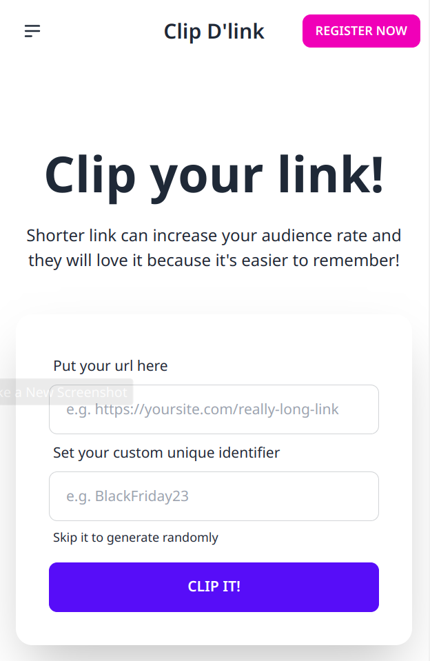
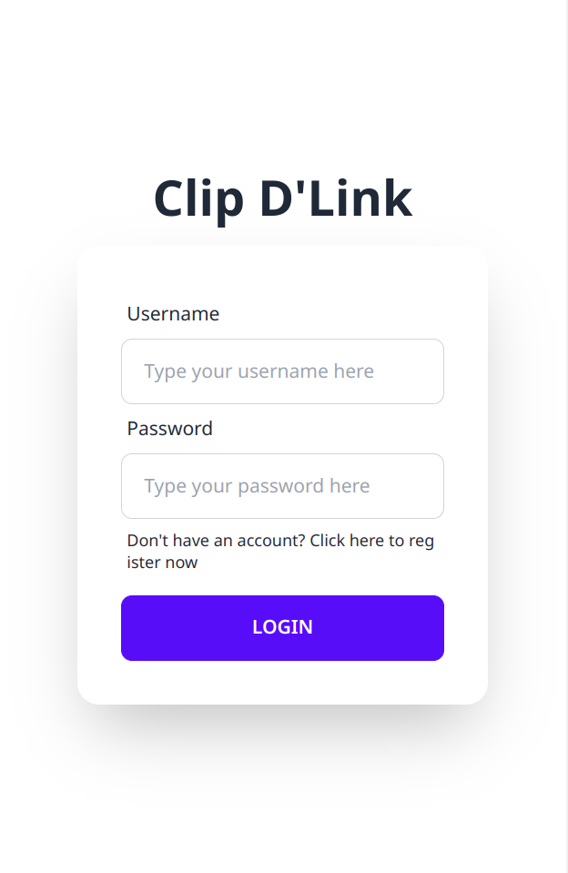
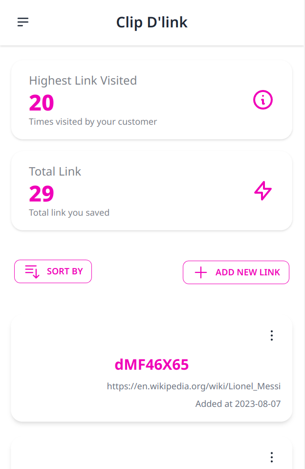
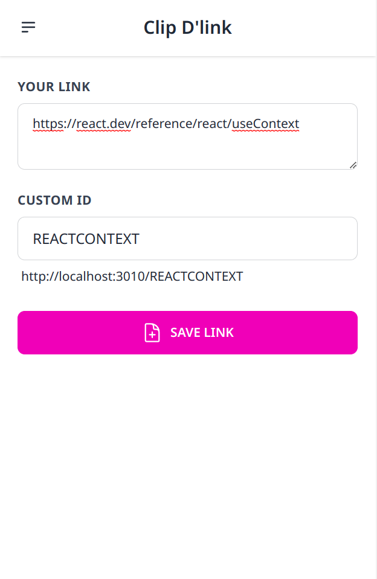

# Clip-Dlink

A web-app to transform long link to be a shorter link. This web-app is written in React.

## Requirements

- Node JS version 18 or above.
- Need the API in this repository [Clip-Dlink-API](https://github.com/wruandev/clip-dlink-api).

## Features

- Transform a long link to be a shorter link.
- Login and Register User.
- Manage saved link by user such as show, add, edit, and delete links.

## Screenshots

<!--  -->

## License

MIT
